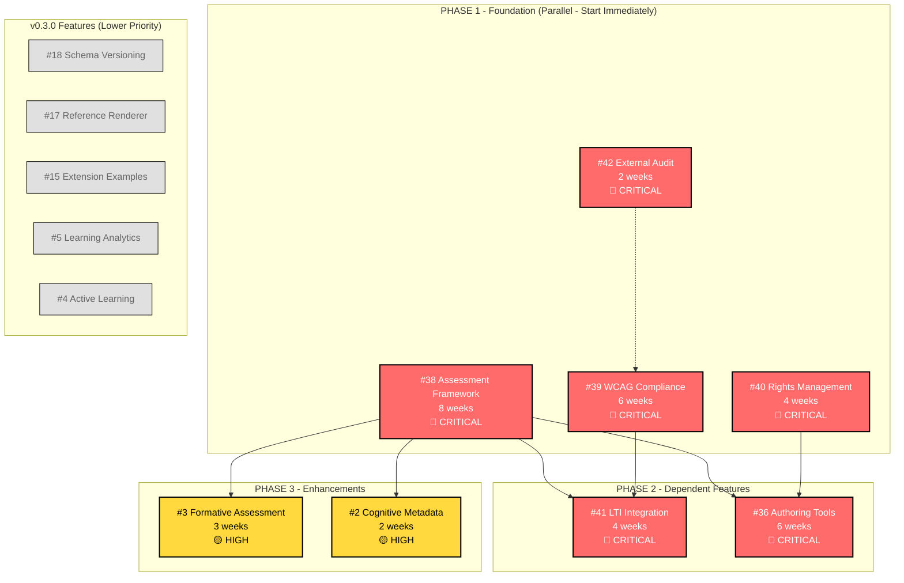

# xats v0.2.0 Dependency Graph
**Updated**: 2025-08-18  
**Status**: All issues updated with dependency relationships

## Critical Path Analysis

## Issue Status Summary

### ✅ UPDATED - Phase 1 Foundation (No Dependencies)
- **#38** - Assessment Framework - **START IMMEDIATELY**
- **#39** - WCAG Compliance - **START IMMEDIATELY** 
- **#40** - Rights Management - **START IMMEDIATELY**
- **#42** - External Audit - **START IMMEDIATELY**

### ✅ UPDATED - Phase 2 Dependent (Wait for Phase 1)
- **#41** - LTI Integration - **DEPENDS ON**: #38 + #39
- **#36** - Authoring Tools - **DEPENDS ON**: #38 + #40

### ✅ UPDATED - Phase 3 Enhancement (Wait for Core Assessment)
- **#3** - Formative Assessment - **DEPENDS ON**: #38
- **#2** - Cognitive Metadata - **DEPENDS ON**: #38

### 🔄 NOT UPDATED - v0.3.0 Issues
- #18, #17, #15, #5, #4 - Lower priority, no immediate dependencies

## Critical Path Timeline

| Week | Phase 1 | Phase 2 | Phase 3 |
|------|---------|---------|---------|
| 1-2  | All 4 issues start | ❌ Wait | ❌ Wait |
| 3-4  | A42 complete, others continue | ❌ Wait | ❌ Wait |
| 5-6  | A40 complete, A38/A39 continue | ❌ Wait | ❌ Wait |
| 7-8  | A39 complete | A36 starts | ❌ Wait |
| 9    | A38 complete | A41 starts | A3, A2 start |
| 10-12| Phase 1 DONE | A41, A36 continue | A3, A2 continue |
| 13-14| - | Phase 2 DONE | Phase 3 DONE |

## Risk Assessment

### HIGHEST RISK (Project Killers)
- **#38** - No assessments = no educational use
- **#39** - Legal liability blocks all public release

### HIGH RISK (Adoption Blockers)  
- **#41** - No LMS integration = no institutional adoption
- **#40** - No rights = no commercial adoption

### MEDIUM RISK
- **#36** - Hard authoring blocks content creation scale

## Duplicate Issues to Close

### Assessment Framework Duplicates
- Close #32 → Link to #38 (primary)
- Close #1 → Link to #38 (primary)  
- Close #13 → Link to #38 (primary)

### WCAG Compliance Duplicates
- Close #33 → Link to #39 (primary)

### Rights Management Duplicates  
- Close #34 → Link to #40 (primary)

### LTI Integration Duplicates
- Close #35 → Link to #41 (primary)

## Team Allocation Recommendations

### Phase 1 Sprint Teams (Parallel)
- **Assessment Team**: Focus on #38 (highest impact)
- **Accessibility Team**: Focus on #39 + #42 coordination
- **Rights Team**: Focus on #40 (smallest scope)

### Phase 2 Sprint Teams (Sequential)
- **Integration Team**: #41 after #38+#39 ≥80% complete
- **Tooling Team**: #36 after #38+#40 ≥80% complete

**⚠️ DO NOT START Phase 2 until Phase 1 dependencies are substantially complete**