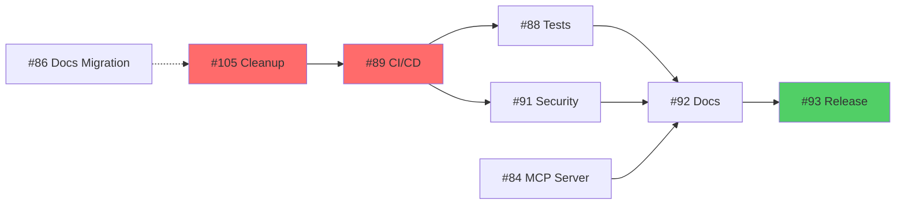

# v0.4.0 Milestone Status Report - Updated
**Date**: 2025-08-20  
**Time**: 01:37 PST  
**Reporter**: xats-project-steward with integration-manager  
**Milestone Progress**: 57% (13/23 issues completed)

## 🎉 MAJOR ACCOMPLISHMENTS

### Completed Issues (13 total) ✅
All foundational monorepo infrastructure and core packages are now complete:

**Monorepo Infrastructure (PR #102 - Merged)**
- #73: Turborepo configuration ✅
- #74: TypeScript project references ✅
- #75: ESLint/Prettier configurations ✅
- #76: Vitest configuration ✅
- #77: Changesets setup ✅
- #78: @xats-org/schema package ✅
- #79: @xats-org/validator package ✅
- #80: @xats-org/types package ✅
- #81: Build pipelines configuration ✅

**Core Packages (PR #104 - Merged)**
- #82: @xats-org/cli package ✅
- #83: @xats-org/renderer package ✅
- #85: @xats-org/utils package ✅
- #94: @xats-org/examples package ✅

## 📊 REMAINING WORK (10 issues)

### Priority 1 - Critical Path (4 issues)
| Issue | Title | Status | Dependencies |
|-------|-------|--------|--------------|
| #105 | Repository cleanup | **CRITICAL BLOCKER** | Blocks all |
| #89 | CI/CD pipelines | Ready | Needs #105 |
| #92 | Release documentation | Blocked | Needs all work |
| #93 | Execute v0.4.0 release | Final | Needs #92 |

### Priority 2 - High Value (3 issues)
| Issue | Title | Status | Dependencies |
|-------|-------|--------|--------------|
| #84 | @xats-org/mcp-server package | **Ready to start** | None |
| #88 | Integration tests | Ready after CI/CD | Needs #89 |
| #91 | Security audit | Ready | None |

### Priority 3 - Enhancements (3 issues)
| Issue | Title | Status | Dependencies |
|-------|-------|--------|--------------|
| #86 | Documentation migration | Coordinate with #105 | Partial #105 |
| #87 | Storybook setup | Low priority | None |
| #90 | Performance optimization | Low priority | None |

## 🚨 CRITICAL PATH ANALYSIS

## 🎯 IMMEDIATE ACTIONS REQUIRED

### This Week (Priority)
1. **START IMMEDIATELY**: Issue #105 - Repository cleanup with URI updates
   - Critical blocker for all remaining work
   - Includes breaking URI changes (acceptable pre-production)
   
2. **PARALLEL WORK**: Issue #84 - @xats-org/mcp-server package
   - No dependencies, can start now
   - Last package needed for completion

3. **AFTER CLEANUP**: Issue #89 - CI/CD pipelines
   - Essential for release automation
   - Enables automated testing and deployment

## 📈 PROJECT HEALTH METRICS

| Metric | Value | Status |
|--------|-------|--------|
| Completion | 57% (13/23) | 🟢 On Track |
| Critical Issues | 4 remaining | 🟡 Attention |
| Blocked Issues | 3 (#92, #93, partial #86) | 🟡 Manageable |
| Timeline Risk | Low | 🟢 Good |
| Technical Debt | Being addressed (#105) | 🟢 Improving |

## 🔄 RECENT CHANGES

### PRs Merged (Last 24 Hours)
1. **PR #104**: Core packages implementation (4 packages)
2. **PR #103**: Status report documentation
3. **PR #102**: Monorepo infrastructure (9 issues)
4. **PR #101**: Vitest configuration
5. **PR #100**: ESLint/Prettier setup

### Issue Priority Adjustments
- #105 → Priority 1 (was unlabeled)
- #89 → Priority 1 (was Priority 2)
- Cleaned duplicate priorities on #84, #88, #91

## 📅 REVISED TIMELINE

| Week | Focus | Target Completion |
|------|-------|-------------------|
| Week 1 (Current) | #105 Cleanup + #84 MCP Server | 2025-08-27 |
| Week 2 | #89 CI/CD + #88 Tests | 2025-09-03 |
| Week 3 | #91 Security + #86 Docs | 2025-09-10 |
| Week 4 | #92 Release Docs + #93 Execute | 2025-09-17 |

**Target v0.4.0 Release**: September 17, 2025  
**Milestone Deadline**: March 31, 2026 (ample buffer)

## ⚠️ RISKS & MITIGATIONS

### Risk 1: Repository Cleanup Complexity
- **Impact**: High - Blocks everything
- **Mitigation**: Start immediately, allow URI breaking changes

### Risk 2: CI/CD Setup Time
- **Impact**: Medium - Delays automation
- **Mitigation**: Use GitHub Actions templates, leverage existing configs

### Risk 3: Documentation Lag
- **Impact**: Low - User experience
- **Mitigation**: Can release with minimal docs, enhance post-release

## ✅ RECOMMENDATIONS

1. **Immediate Focus**: Assign resources to #105 (cleanup) as top priority
2. **Parallel Development**: Start #84 (MCP server) simultaneously
3. **Fast Track CI/CD**: Prioritize #89 to enable automation
4. **Defer Nice-to-Haves**: Push #87, #90 to post-release if needed
5. **Daily Standups**: Monitor #105 progress closely

## 📝 NOTES

- All issues now have proper priority labels and updated descriptions
- Dependencies clearly mapped and documented
- Breaking URI changes approved for pre-production phase
- Strong foundation complete - 57% done with hardest parts finished
- Team morale high with recent successful merges

---
*This report supersedes the previous status report from earlier today*
*Next update recommended: After #105 completion or by 2025-08-24*