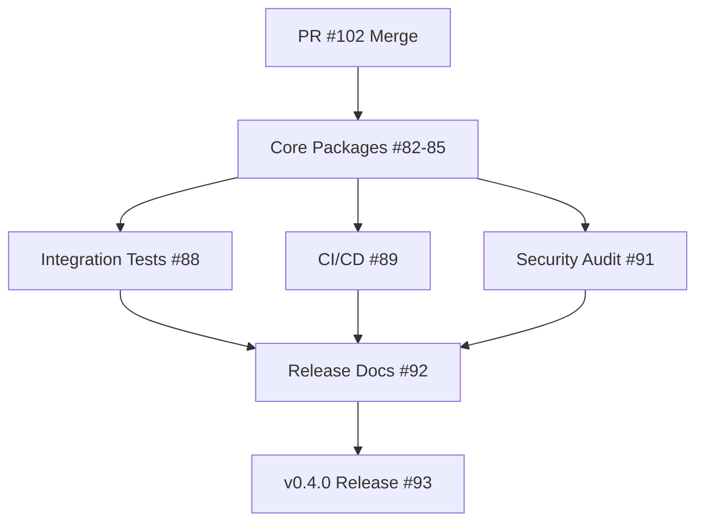

# v0.4.0 Milestone Status Report
**Date**: 2025-08-20  
**Reporter**: xats-project-steward  
**Milestone Progress**: 41% (9/22 issues completed)

## ✅ COMPLETED ISSUES (9 total)

### Already Merged
- **#74** - TypeScript project references (CLOSED)
- **#75** - ESLint/Prettier configurations (CLOSED)  
- **#76** - Vitest configuration (CLOSED)

### Implemented in PR #102 (Awaiting Merge)
- **#73** - Turborepo configuration
- **#77** - Changesets setup
- **#78** - @xats-org/schema package
- **#79** - @xats-org/validator package
- **#80** - @xats-org/types package
- **#81** - Build pipelines configuration

## 🔄 REMAINING OPEN ISSUES (13 total)

### High Priority - Core Packages (Ready to Start)
| Issue | Title | Priority | Dependencies |
|-------|-------|----------|--------------|
| #82 | @xats-org/cli package | P2→P1 | ✅ Ready |
| #83 | @xats-org/renderer package | P2→P1 | ✅ Ready |
| #84 | @xats-org/mcp-server package | P2→P1 | ✅ Ready |
| #85 | @xats-org/utils package | P2→P1 | ✅ Ready |

### Testing & Quality Assurance
| Issue | Title | Priority | Dependencies |
|-------|-------|----------|--------------|
| #88 | Integration tests | P2→P1 | Needs #82-85 |
| #89 | CI/CD pipelines | P2→P1 | Needs #82-85 |
| #91 | Security audit | P2→P1 | Needs #82-85 |
| #90 | Performance optimization | P3 | Needs #82-85 |

### Documentation & Examples
| Issue | Title | Priority | Dependencies |
|-------|-------|----------|--------------|
| #86 | Documentation migration | P3 | Needs packages |
| #87 | Storybook setup | P3 | Needs #83 |
| #94 | Examples package | P2 | ✅ Ready |

### Release Preparation
| Issue | Title | Priority | Dependencies |
|-------|-------|----------|--------------|
| #92 | Release documentation | P1 | Needs all work |
| #93 | Execute v0.4.0 release | P1 | Final step |

## 📊 CRITICAL PATH ANALYSIS

## 🎯 RECOMMENDED ACTIONS

### Immediate (This Week)
1. **Merge PR #102** to unblock development
2. **Start parallel development** on packages #82-85
3. **Update issue priorities** to P1 for critical path items

### Next Sprint (Weeks 2-3)
1. Complete core packages (#82-85)
2. Begin integration testing (#88)
3. Set up CI/CD pipelines (#89)

### Final Sprint (Weeks 4-5)
1. Security audit (#91)
2. Documentation updates (#86, #92)
3. Release preparation (#93)

## 📈 RISK ASSESSMENT

### ✅ Strengths
- Solid foundation complete (41%)
- Clear dependency chain
- No technical blockers

### ⚠️ Risks
- 59% work remaining
- All packages need completion before testing
- Timeline pressure for release

### 🎯 Mitigation
- Parallel package development
- Early CI/CD setup
- Incremental testing approach

## 📅 TIMELINE ESTIMATE

| Phase | Tasks | Duration | Target Date |
|-------|-------|----------|-------------|
| Foundation | PR #102 merge | 1 day | 2025-08-21 |
| Core Packages | #82-85 | 2 weeks | 2025-09-04 |
| Testing & QA | #88, #89, #91 | 1 week | 2025-09-11 |
| Documentation | #86, #92, #94 | 1 week | 2025-09-18 |
| Release | #93 | 2 days | 2025-09-20 |

**Estimated Completion**: September 20, 2025 (4 weeks)

## 📝 NOTES

- All issues properly configured with milestones and labels
- PR #102 correctly references all implemented issues
- Dependencies clearly mapped and understood
- Team should focus on parallel package development after PR merge

---
*This report is stored in `.claude/memory/contexts/` for future reference*