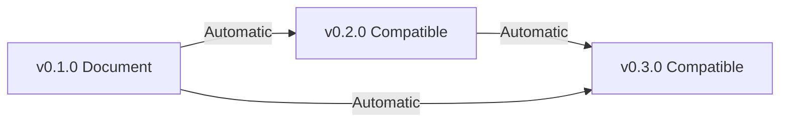

# Version Compatibility Matrix

## Overview

This document provides a comprehensive compatibility matrix for xats schema versions, including feature availability, tool support, and upgrade paths. Use this reference to understand which features are available in each version and plan your migration strategy.

## Table of Contents

- [Quick Reference](#quick-reference)
- [Version Compatibility](#version-compatibility)
- [Feature Availability Matrix](#feature-availability-matrix)
- [Tool Support Matrix](#tool-support-matrix)
- [Upgrade Paths](#upgrade-paths)
- [Breaking Changes Summary](#breaking-changes-summary)
- [Ecosystem Compatibility](#ecosystem-compatibility)

## Quick Reference

| Version | Status | Release Date | End of Life | Compatibility |
|---------|--------|-------------|-------------|---------------|
| **0.3.0** | 🚧 Development | TBD | TBD | Forward compatible with 0.2.0 |
| **0.2.0** | ✅ Stable | 2025-01-20 | TBD | Forward compatible with 0.1.0 |
| **0.1.0** | 🔒 Security Only | 2025-01-17 | 2026-01-01 | Initial release |

## Version Compatibility

### Forward Compatibility

Documents are **forward compatible** within the same major version:

```
0.1.0 → 0.2.0 ✅ (Automatic)
0.1.0 → 0.3.0 ✅ (Automatic)  
0.2.0 → 0.3.0 ✅ (Automatic)
```

### Backward Compatibility

Newer consumers can process older documents:

```
v0.3.0 tools → v0.1.0 docs ✅
v0.2.0 tools → v0.1.0 docs ✅
v0.1.0 tools → v0.2.0 docs ❌ (May fail on new features)
```

## Feature Availability Matrix

### Core Features

| Feature | v0.1.0 | v0.2.0 | v0.3.0 | Notes |
|---------|--------|--------|--------|-------|
| **Document Structure** | ✅ | ✅ | ✅ | Core schema stable across versions |
| **SemanticText** | ✅ | ✅ | ✅ | Enhanced with IndexRun in v0.3.0 |
| **ContentBlocks** | ✅ | ✅ | ✅ | New blocks added each version |
| **Pathways** | ✅ | ✅ | ✅ | Stable API across versions |
| **Extensions** | ✅ | ✅ | ✅ | Enhanced extension support |
| **References** | ✅ | ✅ | ✅ | Stable API across versions |
| **Bibliography** | ✅ | ✅ | ✅ | CSL-JSON format consistent |

### Content Block Types

| Block Type | v0.1.0 | v0.2.0 | v0.3.0 | URI |
|------------|--------|--------|--------|-----|
| **Paragraph** | ✅ | ✅ | ✅ | `https://xats.org/vocabularies/blocks/paragraph` |
| **Heading** | ✅ | ✅ | ✅ | `https://xats.org/vocabularies/blocks/heading` |
| **List** | ✅ | ✅ | ✅ | `https://xats.org/vocabularies/blocks/list` |
| **Blockquote** | ✅ | ✅ | ✅ | `https://xats.org/vocabularies/blocks/blockquote` |
| **Code Block** | ✅ | ✅ | ✅ | `https://xats.org/vocabularies/blocks/codeBlock` |
| **Math Block** | ✅ | ✅ | ✅ | `https://xats.org/vocabularies/blocks/mathBlock` |
| **Table** | ✅ | ✅ | ✅ | `https://xats.org/vocabularies/blocks/table` |
| **Figure** | ✅ | ✅ | ✅ | `https://xats.org/vocabularies/blocks/figure` |
| **Image** | ✅ | ✅ | ✅ | `https://xats.org/vocabularies/blocks/image` |
| **Definition** | ✅ | ✅ | ✅ | `https://xats.org/vocabularies/blocks/definition` |
| **Example** | ✅ | ✅ | ✅ | `https://xats.org/vocabularies/blocks/example` |
| **Theorem** | ✅ | ✅ | ✅ | `https://xats.org/vocabularies/blocks/theorem` |
| **Quote** | ✅ | ✅ | ✅ | `https://xats.org/vocabularies/blocks/quote` |
| **Case Study** | ❌ | ❌ | ✅ | `https://xats.org/vocabularies/blocks/caseStudy` |
| **Metacognitive Prompt** | ❌ | ❌ | ✅ | `https://xats.org/vocabularies/blocks/metacognitivePrompt` |

### SemanticText Runs

| Run Type | v0.1.0 | v0.2.0 | v0.3.0 | Usage |
|----------|--------|--------|--------|-------|
| **TextRun** | ✅ | ✅ | ✅ | Plain text content |
| **EmphasisRun** | ✅ | ✅ | ✅ | Emphasized text (italic) |
| **StrongRun** | ✅ | ✅ | ✅ | Strong text (bold) |
| **ReferenceRun** | ✅ | ✅ | ✅ | Internal document references |
| **CitationRun** | ✅ | ✅ | ✅ | Bibliography citations |
| **IndexRun** | ❌ | ❌ | ✅ | Index term marking |

### Assessment Framework

| Feature | v0.1.0 | v0.2.0 | v0.3.0 | Description |
|---------|--------|--------|--------|-------------|
| **Multiple Choice** | ❌ | ✅ | ✅ | Standard MC questions with multiple options |
| **Short Answer** | ❌ | ✅ | ✅ | Text-based responses |
| **Essay Prompts** | ❌ | ✅ | ✅ | Long-form writing assignments |
| **Rubrics** | ❌ | ✅ | ✅ | Scoring criteria for assessments |
| **Feedback System** | ❌ | ✅ | ✅ | Option-specific feedback and explanations |
| **Pedagogical Metadata** | ❌ | ✅ | ✅ | Bloom's Taxonomy, DOK levels |
| **Cognitive Metadata** | ❌ | ✅ | ✅ | Learning objectives and outcomes |
| **Accessibility Settings** | ❌ | ✅ | ✅ | Accommodations and universal design |

### Accessibility Features

| Feature | v0.1.0 | v0.2.0 | v0.3.0 | WCAG Level |
|---------|--------|--------|--------|------------|
| **Language Identification** | ❌ | ✅ | ✅ | AA |
| **Alt Text** | ⚠️ Basic | ✅ Enhanced | ✅ | AA |
| **Long Descriptions** | ❌ | ✅ | ✅ | AA |
| **Structural Navigation** | ⚠️ Basic | ✅ | ✅ | AA |
| **Skip Navigation** | ❌ | ✅ | ✅ | AA |
| **Reading Order** | ❌ | ✅ | ✅ | AA |
| **Keyboard Navigation** | ❌ | ✅ | ✅ | AA |
| **Screen Reader Support** | ⚠️ Partial | ✅ | ✅ | AA |

### Integration Features

| Integration | v0.1.0 | v0.2.0 | v0.3.0 | Standard |
|-------------|--------|--------|--------|----------|
| **LTI 1.3** | ❌ | ✅ | ✅ | IMS Global |
| **Assignment and Grade Services** | ❌ | ✅ | ✅ | LTI Advantage |
| **Deep Linking 2.0** | ❌ | ✅ | ✅ | LTI Advantage |
| **Names and Role Provisioning** | ❌ | ✅ | ✅ | LTI Advantage |
| **Rights Management** | ❌ | ✅ | ✅ | Custom Extension |
| **File Modularity** | ❌ | ✅ | ✅ | Custom Extension |

### Extensions

| Extension | v0.1.0 | v0.2.0 | v0.3.0 | Namespace |
|-----------|--------|--------|--------|-----------|
| **LTI 1.3** | ❌ | ✅ v1.3.0 | ✅ v1.3.0 | `https://xats.org/extensions/lti` |
| **Rights Management** | ❌ | ✅ v0.1.0 | ✅ v0.1.0 | `https://xats.org/extensions/rights` |
| **Assessment Core** | ❌ | ✅ v0.2.0 | ✅ v0.2.0 | Built-in |
| **File Modularity** | ❌ | ✅ v0.1.0 | ✅ v0.1.0 | Built-in |

## Tool Support Matrix

### Official Tools

| Tool | v0.1.0 | v0.2.0 | v0.3.0 | Description |
|------|--------|--------|--------|-------------|
| **@xats-org/core** | ✅ v0.1.x | ✅ v0.2.x | 🚧 v0.3.x | Schema validation library |
| **xats-validate CLI** | ✅ | ✅ | 🚧 | Command-line validator |
| **TypeScript Types** | ✅ | ✅ | 🚧 | Type definitions |
| **JSON Schema** | ✅ | ✅ | 🚧 | Validation schemas |

### Third-Party Tools

| Tool Category | v0.1.0 | v0.2.0 | v0.3.0 | Notes |
|---------------|--------|--------|--------|-------|
| **Authoring Tools** | ⚠️ Limited | ✅ Growing | 🚧 | Community development |
| **Renderers** | ⚠️ Basic | ✅ Enhanced | 🚧 | HTML, PDF, EPUB |
| **LMS Integration** | ❌ | ✅ Canvas, Blackboard | 🚧 | Via LTI 1.3 |
| **Assessment Engines** | ❌ | ✅ Basic | 🚧 Enhanced | QTI compatibility |

### Platform Support

| Platform | v0.1.0 | v0.2.0 | v0.3.0 | LTI Support |
|----------|--------|--------|--------|-------------|
| **Canvas** | ❌ | ✅ | ✅ | LTI 1.3 |
| **Blackboard** | ❌ | ✅ | ✅ | LTI 1.3 |
| **Moodle** | ❌ | ✅ | ✅ | LTI 1.3 |
| **D2L Brightspace** | ❌ | ⚠️ Testing | ✅ | LTI 1.3 |
| **Schoology** | ❌ | ❌ | ⚠️ Planned | LTI 1.3 |

## Upgrade Paths

### Automatic Upgrades (No Changes Required)



All documents automatically work with newer schema versions due to forward compatibility.

### Enhanced Feature Adoption

To take advantage of new features, manual updates are required:

#### v0.1.0 → v0.2.0 Enhancements

```json
// Add accessibility metadata
{
  "schemaVersion": "0.3.0",
  "language": "en-US",
  "accessibility": {
    "wcagLevel": "AA",
    "features": ["altText", "structuralNavigation"]
  }
}

// Add LTI integration
{
  "extensions": {
    "https://xats.org/extensions/lti": {
      "configuration": {
        "platformId": "canvas.instructure.com"
      }
    }
  }
}

// Add assessment capabilities
{
  "blockType": "https://xats.org/extensions/assessment/multipleChoice",
  "content": {
    "prompt": "What is the capital of France?",
    "options": [
      {"id": "a", "text": "London"},
      {"id": "b", "text": "Paris", "correct": true}
    ]
  }
}
```

#### v0.2.0 → v0.3.0 Enhancements

```json
// Add index terms
{
  "runs": [
    {
      "type": "index",
      "term": "photosynthesis",
      "subterms": ["chloroplast", "light reactions"],
      "text": "photosynthesis"
    }
  ]
}

// Add case studies
{
  "blockType": "https://xats.org/vocabularies/blocks/caseStudy",
  "content": {
    "scenario": {
      "title": "Climate Change Impact",
      "background": "A comprehensive analysis..."
    },
    "analysisQuestions": [
      "What are the primary factors?"
    ]
  }
}

// Add metacognitive prompts
{
  "blockType": "https://xats.org/vocabularies/blocks/metacognitivePrompt",
  "content": {
    "promptType": "self-reflection",
    "prompt": "How does this concept connect to what you already know?"
  }
}
```

## Breaking Changes Summary

### v0.1.0 → v0.2.0

**✅ NO BREAKING CHANGES**

All v0.1.0 documents remain fully valid and functional in v0.2.0.

#### Enhancements Added
- Accessibility metadata (optional)
- LTI 1.3 extension (optional)
- Assessment framework (optional)
- Rights management (optional)

### v0.2.0 → v0.3.0

**✅ NO BREAKING CHANGES**

All v0.2.0 documents remain fully valid and functional in v0.3.0.

#### Enhancements Added
- IndexRun in SemanticText (optional)
- Case study blocks (optional)
- Metacognitive prompt blocks (optional)
- Enhanced pedagogical metadata (optional)

### Future Major Versions (v1.0.0+)

Potential breaking changes being considered for v1.0.0:

⚠️ **These are NOT confirmed - subject to RFC process**

- Restructuring extension namespace organization
- Consolidating redundant vocabulary URIs
- Requiring minimum accessibility compliance
- Standardizing assessment metadata structure

## Ecosystem Compatibility

### Publisher Adoption

| Publisher Type | v0.1.0 | v0.2.0 | v0.3.0 | Notes |
|----------------|--------|--------|--------|-------|
| **Academic Publishers** | ✅ Pilot | ✅ Production | 🚧 Planned | Major textbook publishers |
| **Open Educational Resources** | ✅ | ✅ | 🚧 | OER Commons, MIT OpenCourseWare |
| **Learning Content Vendors** | ⚠️ Limited | ✅ | 🚧 | Assessment and interactive content |
| **Independent Authors** | ✅ | ✅ | 🚧 | Individual faculty and instructors |

### Technology Stack Compatibility

| Technology | v0.1.0 | v0.2.0 | v0.3.0 | Implementation |
|------------|--------|--------|--------|----------------|
| **Node.js** | ✅ 18+ | ✅ 18+ | ✅ 18+ | Official support |
| **Python** | ⚠️ Community | ✅ Community | 🚧 | Third-party libraries |
| **Java** | ❌ | ⚠️ Community | 🚧 | Third-party libraries |
| **C#/.NET** | ❌ | ❌ | ⚠️ Planned | Third-party libraries |
| **PHP** | ❌ | ⚠️ Community | 🚧 | Third-party libraries |

## Migration Recommendations

### For Content Authors

1. **Start with v0.2.0**: Use current stable version for new content
2. **Plan for v0.3.0**: Consider case studies and metacognitive features
3. **Accessibility First**: Implement WCAG AA compliance from start
4. **LTI Ready**: Configure LTI if targeting LMS deployment

### For Tool Developers

1. **Support Multiple Versions**: Handle v0.1.0, v0.2.0, and v0.3.0
2. **Feature Detection**: Check capabilities rather than versions
3. **Graceful Degradation**: Ignore unknown fields and extensions
4. **Forward Planning**: Prepare for v1.0.0 stabilization

### For Institutions

1. **Pilot with v0.2.0**: Stable features with good tool support
2. **Plan LTI Integration**: Leverage assessment and grade passback
3. **Accessibility Compliance**: Meet institutional accessibility requirements
4. **Version Management**: Establish version control and migration procedures

## Support and Resources

### Documentation
- [Schema Versioning Policy](schema-versioning-policy.md)
- [Migration Guide v0.1.0 → v0.2.0](../guides/migration-guide.md)
- [Schema Reference](../reference/index.md)

### Community
- [GitHub Issues](https://github.com/xats-org/core/issues)
- [Discussion Forum](https://github.com/xats-org/core/discussions)
- [RFC Process](https://github.com/xats-org/rfcs)

### Tools
- [Online Validator](https://validator.xats.org)
- [Schema Browser](https://schema.xats.org)
- [Migration Tools](https://tools.xats.org/migrate)

---

*This compatibility matrix is updated with each schema release. Last updated: 2025-08-19*